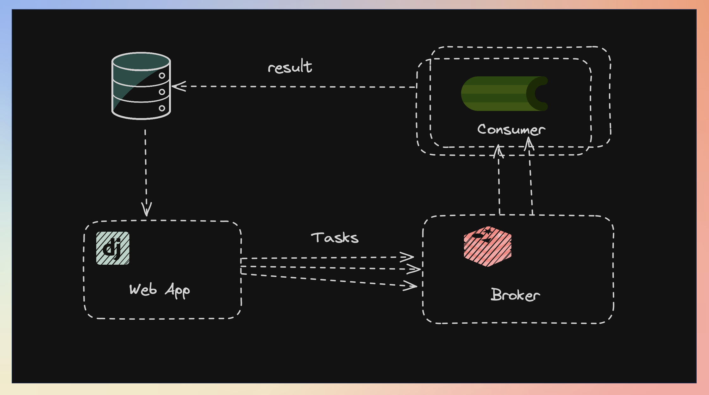

# Run Background Tasks Using Django + Celery + Redis
Learn how to run background tasks in your django project using celery + redis

## Tutorial on YouTube:
- [Tutorial Link](https://youtu.be/TnVqa3puGps)

## Outline:
- What is celery
- How it works
- Install celery & redis
- Create new Django project
- Setup celery in Django
- sample celery task 

